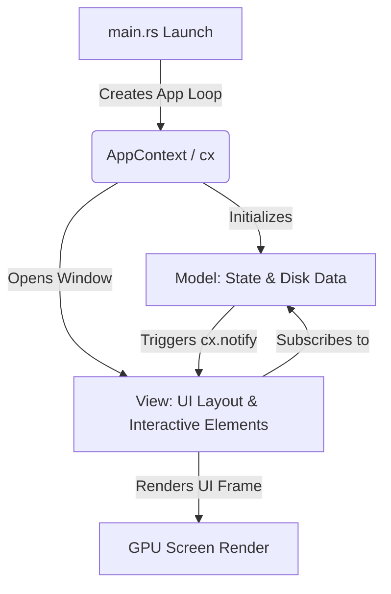

# Desktop Development Best Practices (GPUI Architecture)

This guide outlines architectural patterns and best practices for building high-performance desktop applications with GPUI (the engine behind the Zed editor), comparing it to traditional web paradigms.

---

## 1. State Management Hierarchy

In GPUI and modern desktop frameworks, state is distributed into three clear levels. Never store all state in a single monolithic structure or in the `main` entry point.

| State Level | Where it Lives | Best For | Web Analog |
| :--- | :--- | :--- | :--- |
| **Local View State** | Fields on your `Render` View struct (e.g. `PremiereLayout`) | UI-specific properties (active tab selection, drag handles, input fields, open dropdowns). | React Component `useState` |
| **Shared Model State** | `Model<T>` registered in the App Context (`cx.new_model`) | Core business data (loaded files, user models, caches, sync status). | Redux / Zustand store |
| **Global Context State** | Global fields in `cx` or global settings configurations | Cross-cutting concerns (active theme colors, keyboard shortcuts, window bounds). | React Context / Global window |

---

## 2. GPUI Architecture Flow

Unlike web apps that rely on virtual DOM diffing, GPUI uses an **Entity-Component** architecture. Views observe Models, and GPUI schedules re-renders efficiently when observed states notify change.



---

## 3. Core Best Practices

### 💡 Rule 1: Never Block the Main UI Thread
Desktop UIs run at 60fps (or 120fps+). Any synchronous file system I/O, database query, or network request on the main thread will cause the UI to stutter (dropped frames).
- **Bad:** Reading a large file directly in an event handler or `render` method.
- **Good:** Offload I/O to background tasks using `cx.spawn()` or `cx.background_executor().spawn()`, then update state on the main thread when finished.

> [!IMPORTANT]
> If a file operation takes even 10ms, it will drop frames. Always use async tasks for file reading/writing.

### 💡 Rule 2: Keep Render Functions Pure
GPUI calls `render()` frequently (on mouse moves, cursor changes, resizes).
- Do not perform state changes, network requests, or disk operations inside `render()`.
- Only use `render()` to translate current struct properties into GPUI UI elements (`div()`, `svg()`, etc.).

### 💡 Rule 3: Use Modular Submodule Implementations
When a layout grows large (like our Premiere Pro interface), do not dump everything in one file.
- Separate panels into distinct files (e.g. `panel_timeline.rs`, `panel_project.rs`).
- Use Rust's shared implementation blocks:
  ```rust
  // In panel_project.rs
  impl PremiereLayout {
      pub(crate) fn render_project_panel(&self, cx: &mut Context<Self>) -> impl IntoElement { ... }
  }
  ```
- This keeps your files clean and simple while maintaining access to state fields and event handlers without complex callback passing.

### 💡 Rule 4: Handle Cross-Platform Paths Safely
Different operating systems have different folder layouts and root systems.
- Always use `std::path::PathBuf` instead of manual string formatting to join paths.
- Guard OS-specific file paths using compiler directives:
  ```rust
  #[cfg(target_os = "windows")]
  let path = "C:\\";

  #[cfg(not(target_os = "windows"))]
  let path = "/";
  ```

---

## 4. Code Structuring Template

Here is the recommended folder structure for a modular GPUI project:

```
my_app/
├── Cargo.toml
└── src/
    ├── main.rs            # Entry point, Window manager, Main View Shell
    ├── assets.rs          # Asset pipeline (SVG/Font providers)
    ├── models/
    │   ├── document.rs    # Pure data management models (No UI)
    │   └── settings.rs    # User settings state
    └── views/
        ├── sidebar.rs     # Left panel UI implementation
        ├── editor.rs      # Editor pane UI implementation
        └── status_bar.rs  # Bottom info bar UI implementation
```
